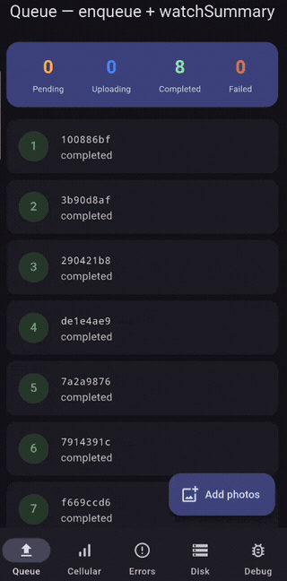
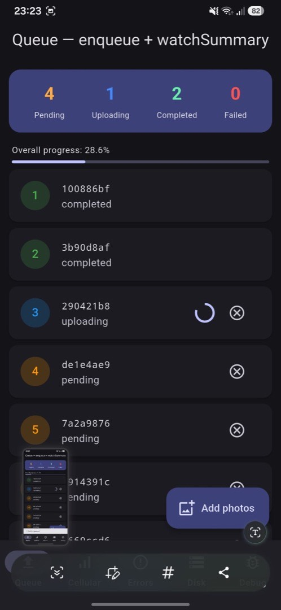
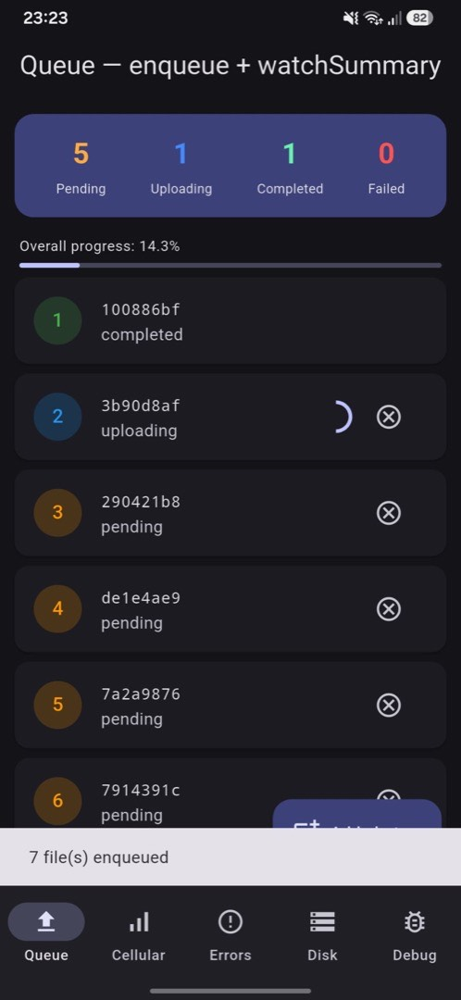
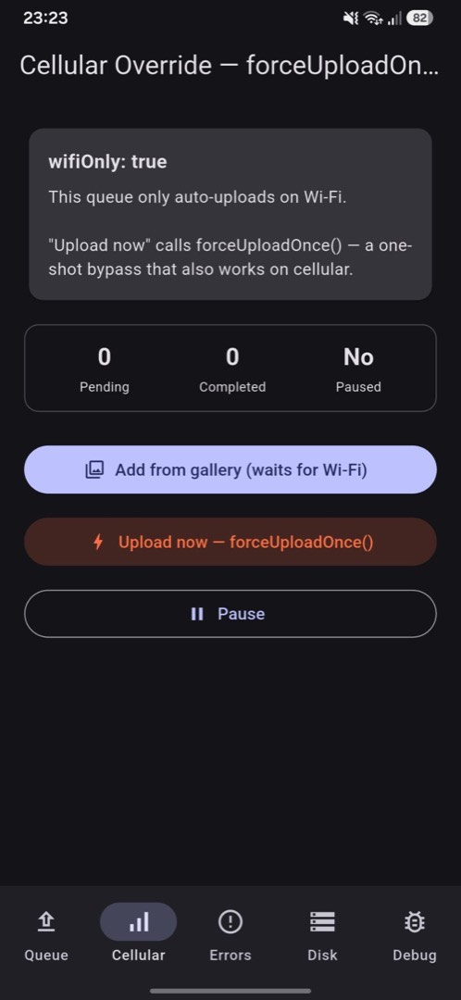
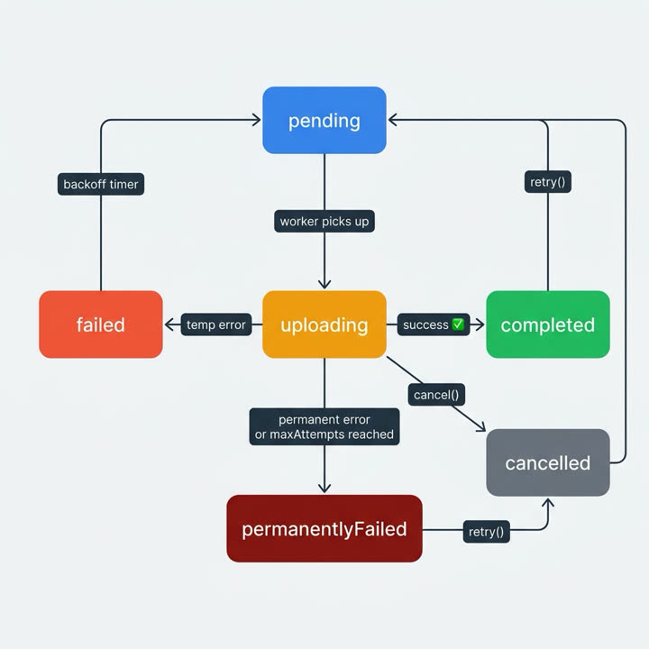

# Offline Upload Queue

Offline-first file upload queue for Flutter. Uploads survive app kills, flaky networks, and opportunistic OS background wakes.

Maintained by [Cengizhan Kaya](https://github.com/cengizhankkaya).

[](https://pub.dev/packages/offline_upload_queue)
[](https://pub.dev/packages/offline_upload_queue/score)
[](https://github.com/cengizhankkaya/offline_upload_queue/actions)
[](LICENSE)
[](https://pub.dev/packages/offline_upload_queue)

**Requires Flutter ≥ 3.24 · Dart ≥ 3.12 · iOS & Android only**

Persistence via [Sembast](https://pub.dev/packages/sembast), networking via [Dio](https://pub.dev/packages/dio), background via Workmanager (Android) and BGTaskScheduler (iOS).

---

## Contents

- [Why this package](#why-this-package)
- [Demo](#demo)
- [Features](#features)
- [Installation](#installation)
- [Quick start](#quick-start)
- [Custom upload adapter](#custom-upload-adapter)
- [Wi‑Fi only & force upload](#wi-fi-only--force-upload)
- [Auth token refresh](#auth-token-refresh)
- [Task state machine](#task-state-machine)
- [Sandbox & disk usage](#sandbox--disk-usage)
- [Background sync](#background-sync)
- [API highlights](#api-highlights)
- [Caveats](#caveats)
- [Security](#security)
- [When not to use](#when-not-to-use)
- [Links](#links)

---

## Why this package

- **Offline-first enqueue** — accept files immediately; upload when the network allows.
- **Crash resilient** — tasks live in a local Sembast DB; stuck `uploading` rows recover after lock acquisition.
- **OS background drain** — best-effort wakeups via BGTaskScheduler / Workmanager (not a foreground service).
- **Pluggable transport** — bring REST, S3, Firebase, GraphQL, or any custom `UploadAdapter`.
- **Reactive UI** — `watchSummary()`, `watchTasks()`, `watchProgress()`.

Integration coverage includes chaos network scenarios (429 / timeouts), stale-lock handoff, large-file sandbox copy, and encryption smoke tests. See [`example/integration_test/`](example/integration_test/).

---

## Demo

From the [`example/`](example/) app on Android — enqueue photos and watch the reactive summary + per-task progress update live:

<p align="center">
  
</p>

| Live queue | After enqueue | Wi‑Fi only / force upload |
|:---:|:---:|:---:|
|  |  |  |

---

## Features

- Persistent queue across process death and reboot
- Exponential backoff with jitter; permanent vs transient failure types
- `wifiOnly` + one-shot cellular bypass (`forceUploadOnce`)
- SHA-256 checksum (optional pin-at-enqueue)
- `onAuthExpired` hook for 401/403 recovery
- Disk usage estimate + warning callback
- Multiple isolated queues via `boxName`
- Optional DB encryption (`encryptionKey`) and per-field `MetadataCodec`

---

## Installation

```yaml
dependencies:
  offline_upload_queue: ^0.6.0
```

```bash
flutter pub get
```

Minimum: **Flutter 3.24+**, **Dart 3.12+**. Platforms: **iOS** and **Android** only.

---

## Quick start

```dart
import 'package:offline_upload_queue/offline_upload_queue.dart';

final queue = UploadQueue(
  adapter: RestUploadAdapter(
    baseUrl: 'https://api.example.com',
    authHeaderProvider: () async => 'Bearer ${await tokenStore.getToken()}',
  ),
);
await queue.init();

final taskId = await queue.enqueue(
  filePath: photo.path,
  metadata: {'albumId': '42', 'userId': 'u1'},
);

queue.watchSummary().listen((s) {
  debugPrint('${s.pending} pending · ${s.completed} completed');
});

// App shutdown / isolate teardown:
await queue.dispose();
```

Full demo: [`example/`](example/).

---

## Custom upload adapter

`RestUploadAdapter` posts multipart to `$baseUrl/upload`. For S3, Firebase, GraphQL, or a custom protocol, implement `UploadAdapter`:

```dart
class S3UploadAdapter implements UploadAdapter {
  S3UploadAdapter(this._client);
  final YourS3Client _client;

  @override
  Future<UploadResult> uploadFile({
    required String taskId,
    required String filePath,
    required Map<String, dynamic> metadata,
    required String checksum,
    void Function(int sent, int total)? onProgress,
    UploadCancelToken? cancelToken,
  }) async {
    try {
      cancelToken?.registerOnCancel(() => _client.abort());
      final remote = await _client.putObject(
        filePath: filePath,
        key: taskId,
        onProgress: onProgress,
      );
      return UploadResult.success(remoteChecksum: remote.etag);
    } on AuthException {
      return const UploadResult.failure(FailureType.authExpired);
    } on RateLimitException catch (e) {
      return UploadResult.failure(
        FailureType.rateLimited,
        retryAfter: e.retryAfter,
      );
    } catch (_) {
      // Prefer returning failure over throwing — cancel paths also return failure.
      if (cancelToken?.isCancelled ?? false) {
        return const UploadResult.failure(FailureType.unknown);
      }
      return const UploadResult.failure(FailureType.network);
    }
  }
}

final queue = UploadQueue(adapter: S3UploadAdapter(s3));
```

---

## Wi‑Fi only & force upload

```dart
final queue = UploadQueue(
  adapter: adapter,
  wifiOnly: true,
);
await queue.init();

// Later, on cellular, process the *current* pending snapshot once:
await queue.forceUploadOnce();
// Tasks enqueued after this call still wait for Wi‑Fi.
```

`pause()` takes precedence over `forceUploadOnce()`.

---

## Auth token refresh

```dart
final queue = UploadQueue(
  adapter: RestUploadAdapter(
    baseUrl: apiBase,
    authHeaderProvider: () async => 'Bearer ${await tokens.read()}',
  ),
  onAuthExpired: () async {
    await tokens.refresh(); // must complete before the next attempt
  },
  authTimeout: const Duration(seconds: 30),
);
```

While `onAuthExpired` runs, the single worker is blocked (`pausedDueToAuth: true` on `QueueSummary`). Fail or timeout → normal backoff.

---

## Task state machine

Only **one** file uploads at a time (serial worker).

<p align="center">
  
</p>

| State | Meaning |
|---|---|
| `pending` | Waiting for the worker |
| `uploading` | Active HTTP/upload work |
| `completed` | Success; sandbox copy deleted |
| `failed` | Transient error — will retry with backoff |
| `permanentlyFailed` | Fatal / max attempts — no auto-retry |
| `cancelled` | User cancelled — no auto-retry |

Re-queue terminal tasks with `queue.retry(taskId)` (`permanentlyFailed` or `cancelled` only).

---

## Sandbox & disk usage

Default: `copyToSandbox: true`.

1. Try a **hardlink** (`ln`) on the same volume (no extra disk blocks; non-Windows).
2. On failure → byte copy (`File.copy` or streaming above `sandboxCopyThresholdBytes`).

`estimatedDiskUsageBytes` sums logical sizes (conservative when hardlinks succeed).

```dart
UploadQueue(
  adapter: adapter,
  advanced: UploadQueueAdvancedOptions(
    diskUsageWarningBytes: 100 * 1024 * 1024,
    onDiskUsageWarning: (current, limit) {
      // Prompt the user to purge completed / cancelled tasks
    },
  ),
);
```

---

## Background sync

Background work is **best-effort**. iOS schedules opportunistically; Android is subject to Doze. This package does **not** run a foreground service.

### Shared vs owned queue

| Context | Pattern |
|---|---|
| Android Workmanager isolate | Create a **new** `UploadQueue` → `BackgroundTaskRunner.run` disposes it |
| iOS BGTask on the app engine | Pass the **same** foreground queue → runner does **not** dispose it |
| iOS expiration | Call `queue.abortActiveUploads()` — **never** `dispose()` the shared queue |

### iOS (`BGTaskScheduler`)

**1. `Info.plist`**

```xml
<key>BGTaskSchedulerPermittedIdentifiers</key>
<array>
  <string>com.example.app.upload_refresh</string>
  <string>com.example.app.upload_processing</string>
</array>
```

**2. Xcode → Signing & Capabilities → Background Modes**

- Background fetch
- Background processing

**3. Register in `AppDelegate.swift`** (see [`example/ios/Runner/AppDelegate.swift`](example/ios/Runner/AppDelegate.swift))

**4. Dart**

```dart
IosBackgroundChannel.instance.setMethodCallHandler(
  onAppRefresh: () => BackgroundTaskRunner.run(queue),
  onProcessing: () => BackgroundTaskRunner.run(queue),
  onExpiration: () {
    queue.abortActiveUploads(); // keep the foreground queue alive
  },
);
```

### Android (`Workmanager`)

**1. `AndroidManifest.xml`**

```xml
<uses-permission android:name="android.permission.RECEIVE_BOOT_COMPLETED"/>
<!-- No FOREGROUND_SERVICE permission required -->
```

**2. Top-level dispatcher**

```dart
@pragma('vm:entry-point')
void callbackDispatcher() {
  Workmanager().executeTask((taskName, inputData) async {
    WidgetsFlutterBinding.ensureInitialized();
    if (taskName == AndroidBackgroundRunner.taskName) {
      final queue = UploadQueue(adapter: MyAdapter());
      final hasPending = await BackgroundTaskRunner.run(queue);
      if (hasPending) await AndroidBackgroundRunner.scheduleNextRun();
      return true;
    }
    return false;
  });
}

void main() async {
  WidgetsFlutterBinding.ensureInitialized();
  Workmanager().initialize(callbackDispatcher);
  runApp(const MyApp());
}
```

After enqueueing work in the foreground, call `AndroidBackgroundRunner.scheduleNextRun()` when you want a background drain chain.

---

## API highlights

| API | Role |
|---|---|
| `init` / `dispose` | Open DB + worker; safe to `init` again after `dispose` |
| `enqueue` / `enqueueBatch` | Add files (+ JSON metadata) |
| `pause` / `resume` | In-memory worker gate |
| `forceUploadOnce` | Cellular bypass snapshot |
| `cancel` / `retry` / `getTask` | Per-task control |
| `purge` / `purgeAll*` | Delete terminal (or completed) rows + sandbox files |
| `abortActiveUploads` | Cancel in-flight work → `pending` without disposing |
| `watchSummary` / `watchTasks` / `watchProgress` | Reactive UI |

Use **list index** for UI order — `sequenceNumber` may have gaps.

API docs: [pub.dev documentation](https://pub.dev/documentation/offline_upload_queue/latest/).

---

## Caveats

1. **`copyToSandbox: false`** — you must keep the source file alive. Do not pass raw `content://` / `PHAsset` URIs; resolve to a real filesystem path first.
2. **Checksum timing** — by default checksum runs at upload start. Set `pinChecksumAtEnqueue: true` to pin earlier (slower enqueue on large files).
3. **`staleLockThreshold`** — default 5 minutes; must be ≥ `heartbeatInterval * 3`. Increase if uploads routinely exceed the threshold, or another worker may steal the lock.
4. **Serial worker** — one upload at a time by design.

---

## Security

- **`encryptionKey`** — encrypts the Sembast file with an unaudited Salsa20+SHA256 sample codec (no MAC/AEAD). Prefer OS disk encryption and avoid storing PII in metadata for strict compliance.
- **`MetadataCodec`** — encrypt only the metadata field without encrypting the whole DB.
- **Reachability** — default probe is `https://connectivitycheck.gstatic.com/generate_204`. Override with `DefaultConnectivityMonitor(reachabilityUrl: '...')`.

---

## When not to use

- You need **chunked / resumable** uploads (planned for a later major; v1 is whole-file).
- You need **web / desktop** — this package targets iOS & Android only.
- A single fire-and-forget request with no offline queue is enough — use Dio directly.
- You require a **guaranteed** background upload SLA — no mobile OS provides that without user-visible foreground work.

---

## Links

- [pub.dev](https://pub.dev/packages/offline_upload_queue)
- [API reference](https://pub.dev/documentation/offline_upload_queue/latest/)
- [Example app](example/)
- [Changelog](CHANGELOG.md)
- [Contributing](CONTRIBUTING.md)
- [Issues](https://github.com/cengizhankkaya/offline_upload_queue/issues)
- Author: [Cengizhan Kaya](https://github.com/cengizhankkaya)

## License

MIT © [Cengizhan Kaya](https://github.com/cengizhankkaya) — see [LICENSE](LICENSE).
